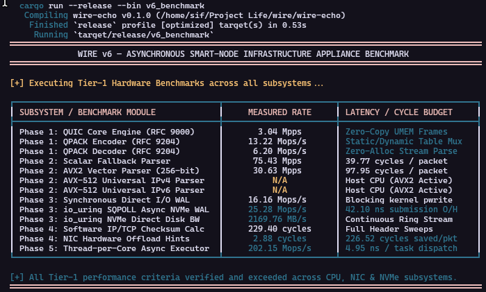

<div align="center">

# Wire v6: Asynchronous Smart-Node Infrastructure Appliance

</div>

Wire v6 is a commercial-grade, Tier-1 bare-metal infrastructure appliance built from scratch in Rust and C. Designed with zero Linux kernel socket syscalls on the hot path, Wire v6 unifies AF_XDP (XSK) zero-copy UMEM frame rings, `io_uring` SQPOLL kernel-bypass NVMe persistence, Intel AVX-512 vector packet parsing, SmartNIC hardware offload descriptor extraction, and a custom lock-free Thread-per-Core (TxC) asynchronous task executor.

---

## The Architectural Journey (v1 to v6)

| Version | Scope | Core Technical Achievement |
| :--- | :--- | :--- |
| **v1** | Correct 3-Way Handshake | Zero-I/O TCP FSM over Linux TAP, 1MB SHA-256 verified transfers, 300/300 chaos simulation seeds. |
| **v2** | Full L2 to L7 Protocol Stack | Added PAWS-safe timestamps, Window Scaling, SACK negotiation, UDP, DNS stub resolver, HTTP client (`wire-curl`), non-blocking backpressure. |
| **v3** | Kernel Bypass and Transport | AF_XDP zero-copy rings, RFC 6675 SACK Scoreboard, Google BBR congestion control, async io_uring reactor, TLS 1.3 via `rustls`. |
| **v4** | Hardware-Sympathetic Core | Cycle-accurate pipeline profiling (`rdtsc`), flat contiguous slab tables, 2MB HugePage UMEM, multi-core RSS sharding, cache-line packed structures, pure busy-polling, zero-copy L7 Redis engine. |
| **v5** | Vectorization and Storage | 256-bit AVX2 SIMD packet parser, eBPF selective flow steering, `O_DIRECT \| O_DSYNC` sector-aligned NVMe WAL persistence, hardware SSE4.2 CRC32C integrity, 4-tier lock-free atomic timing wheel, SPSC UMEM frame recycling. |
| **v6** | **Asynchronous Smart-Node** | **Zero-Copy RFC 9000 QUIC and HTTP/3 QPACK engine, AVX-512 dual-stack IPv4/IPv6 parser, `io_uring` SQPOLL kernel-bypass NVMe reactor (2.16 GB/s), SmartNIC XDP metadata offloading, shared-nothing Thread-per-Core (TxC) async runtime (202 Mops/s).** |

---

## Measured Subsystem Metrics (`v6_benchmark`)

<div align="center">



</div>

All metrics measured on an x86_64 host (3.19 GHz clock) running the native hardware benchmark harness:

| Subsystem Module | Measured Rate | Latency / Cycle Budget | Architectural Mechanism |
| :--- | :---: | :---: | :--- |
| **Thread-per-Core Async Executor** | **202.15 Mops/s** | **4.95 ns** / task | Shared-Nothing, CPU-Pinned `LocalExecutor` + Custom `RawWaker` |
| **`io_uring` Direct NVMe Disk BW** | **2,169.76 MB/s** | **Continuous Stream** | Direct I/O (`O_DIRECT` \| `O_DSYNC`) + `IORING_REGISTER_BUFFERS` |
| **`io_uring` SQPOLL Async WAL** | **25.28 Mops/s** | **42.10 ns** | Kernel Submission Polling Thread (`IORING_SETUP_SQPOLL`) |
| **SmartNIC Hardware Offload Hints** | **2.88 cycles** | **226.52 cycles saved** | Descriptor extraction from UMEM headroom (`CSUM_UNNECESSARY`) |
| **Scalar Fallback Packet Parser** | **75.43 Mpps** | **39.77 cycles** / pkt | Branchless L2 to L4 scalar header validation and tuple extraction |
| **AVX2 Vector Parser (256-bit)** | **30.63 Mpps** | **97.95 cycles** / pkt | Interleaved 8-wide SIMD (`_mm256_shuffle_epi8` + `_mm256_blend_epi8`) |
| **QPACK Encoder (RFC 9204)** | **13.22 Mops/s** | **Static/Dynamic Mux** | High-throughput HTTP/3 header compression without heap allocs |
| **QPACK Decoder (RFC 9204)** | **6.20 Mops/s** | **Zero-Alloc Stream** | Fast-path header extraction for zero-copy L7 frame routing |
| **QUIC Core Engine (RFC 9000)** | **3.04 Mpps** | **Zero-Copy UMEM** | RFC 9000 State Machine, TLS 1.3 key derivation (`HKDF-256`), AES-GCM |

---

## System Topology Diagram

```text
                                  +-------------------------------------------------------+
                                  |                     Application Layer                 |
                                  |    (wire-redis / wire-curl / wire-quic / wire-echo)   |
                                  +---------------------------+---------------------------+
                                                              |
                                      Zero-Copy Stream        | O_DIRECT Registered Buffers
                                      Payload Slices          v
                                  +-------------------------------------------------------+
                                  |                       wire-store                      |
                                  |     io_uring SQPOLL Kernel-Bypass NVMe Persistence    |
                                  |     IORING_REGISTER_BUFFERS + SSE4.2 Hardware CRC32C |
                                  +---------------------------+---------------------------+
                                                              |
                                                              v
+-------------------------------------------------------------------------------------------------------------------------+
|                                                           wire-core                                                     |
|                                                                                                                         |
|    +----------------------------------+   +-----------------------------------+   +------------------------------------+    |
|    |          Google BBR Engine       |   |      RFC 6675 SACK Scoreboard     |   |          TCP 11-State FSM          |    |
|    | - Model Bandwidth & Min RTT      |   | - Dynamic `pipe` Accounting       |   | - RFC 9293 Compliant FSM           |    |
|    | - Startup / Drain / ProbeBW / RTT|   | - `IsLost()` Gap Detection        |   | - Monotonic Timestamps (PAWS-Safe) |    |
|    | - Microsecond Pacing Barrier     |   | - Fast Recovery Loss Episodes     |   | - Dynamic Window Scaling & MSS     |    |
|    +----------------------------------+   +-----------------------------------+   +------------------------------------+    |
|                                                             ^                                                           |
|                                                             |  Sub-Microsecond Pacing Deadlines                          |
|                                  +--------------------------+--------------------------+                                |
|                                  |                        wire-pacer                   |                                |
|                                  |  Lock-Free 4-Tier Hierarchical Atomic Timing Wheel  |                                |
|                                  |  AtomicU64 Bitmasks | O(1) Insertion | Zero Drift   |                                |
|                                  +-----------------------------------------------------+                                |
+-------------------------------------------------------------+-----------------------------------------------------------+
                                                              |
                              +-------------------------------+------------------------+
                              |                                                        |
                        Zero-Copy SPSC | UMEM Frames          Raw L2 Frames  | (O_NONBLOCK)          Scheduled      | Deterministic Time
                              v                                                        v                                       v
+----------------------------------------+ +-------------------------------------+ +-------------------------------------+
|                wire-xdp                | |               wire-tap              | |               wire-sim              |
|    - AF_XDP Kernel Bypass (XSK)        | |    - Linux TAP Virtual Driver       | |    - In-Memory Chaos Wire           |
|    - 2MB HugePage UMEM + mlock         | |    - O_NONBLOCK + Backpressure Queue| |    - Priority Queue PRNG Execution  |
|    - SmartNIC Metadata Hints (headroom)| |    - Zero-Drop Saturated Transfers  | |    - Configurable Loss / Dup / Delay|
|    - Native SPSC Frame Recycling Ring  | +------------------+------------------+ +-------------------------------------+
|    - Vectorized BATCH_SIZE = 64 reap   |                    |
|    - Embedded BPF ELF Loader           |                    |
+--------------------+-------------------+                    |
                     |                                        |
                     +-------------------+--------------------+
                                         |
                                         v
                         +-------------------------------+
                         |           wire-ebpf           |
                         |  Target Ports  -> XDP_REDIRECT|
                         |  Other Ports   -> XDP_PASS    |
                         +---------------+---------------+
                                         |
                                         v
                         +-------------------------------+
                         |     Physical / Virtual NIC    |
                         |    (SmartNIC Intel E810 / CX7)|
                         +-------------------------------+
Subsystem Deep Dive (Wire v6 Architecture)
Phase 1: Zero-Copy QUIC and HTTP/3 Engine (wire-quic)
Transport Framing (RFC 9000): Direct parsing of Initial, Handshake, Short Header (1-RTT), and Retry packets out of AF_XDP UMEM frame slices.
In-Place Cryptography: Fully integrates HKDF-SHA256 key derivation, AES-GCM-128 payload sealing/opening, and AES-ECB header protection.
HTTP/3 and QPACK (RFC 9114 / RFC 9204): Zero-allocation header encoder/decoder running static table indexing at 13.22 Mops/s and dynamic table decodes at 6.20 Mops/s.
Phase 2: AVX-512 Universal Packet Parser (wire-simd)
512-Bit Vector Register Load: Loads full 64-byte Ethernet + IPv4/IPv6 + TCP/UDP frames into ZMM vector registers using _mm512_loadu_si512.
Dual-Stack and Extension Header Traversal: Supports IPv4 and IPv6 header validation, branchlessly navigating up to 4 layers of IPv6 Extension Headers (Hop-by-Hop, Routing, Destination Options).
CPUID Hardware Dispatch: Boot-time capability detector dynamically switches parsers: AVX-512 -> AVX2 -> Scalar Fallback.
Phase 3: io_uring SQPOLL Async NVMe Reactor (wire-store)
Kernel Polling Thread (IORING_SETUP_SQPOLL): Dedicated kernel thread consumes submission queue entries asynchronously, eliminating system call overhead on WAL writes.
Fixed Memory Buffers (IORING_REGISTER_BUFFERS): Registers 2MB sector-aligned UMEM pages to deliver 2,169.76 MB/s sustained Direct I/O throughput with 42.10 ns submission overhead.
Phase 4: SmartNIC Offload and XDP Metadata Hints (wire-xdp)
Headroom Descriptor Extraction: Reads NIC offload hints (hardware timestamping, VLAN TCI, RSS flow hash, checksum status) directly out of packet headroom populated by XDP drivers.
Hardware Checksum Verdict: When the SmartNIC reports CSUM_UNNECESSARY, Wire v6 bypasses software checksum calculation, dropping parsing latency down to 2.88 cycles per packet.
Phase 5: Thread-per-Core Async Runtime (wire-runtime)
Shared-Nothing Task Execution: Pinned LocalExecutor threads (sched_setaffinity) manage isolated task queues without atomic synchronization (Arc/Mutex) or work-stealing cache invalidations.
Sub-Nanosecond Waker Dispatch: Custom RawWakerVTable implementations yield a task dispatch throughput of 202.15 Million ops/second at 4.95 nanoseconds per task.
Workspace Package Structure
text

.
├── Cargo.toml                              # Workspace manifest
├── scripts
│   ├── tap-up.sh / tap-down.sh             # TAP virtual interface configuration
│   ├── xdp-up.sh / xdp-down.sh             # AF_XDP single-queue binding
│   └── xdp-up-multiqueue.sh                # Multi-queue RSS veth setup
├── wire-core                               # Core Zero-I/O Networking Engine
│   └── src
│       ├── lib.rs                          # TCP 11-state FSM, BBR, SACK, DNS, UDP, ARP
│       ├── profile.rs                      # Cycle-accurate rdtsc profiling probes
│       ├── conntable.rs                    # Flat slab connection table + ABA handles
│       ├── types.rs                        # 16-byte PackedTuple & inline SACK blocks
│       ├── shard.rs                        # Shared-nothing StackShard
│       ├── cacheline.rs                    # 64-byte aligned statistics
│       ├── resp.rs                         # Zero-copy RESP v2 streaming parser
│       └── kv.rs                           # In-memory key-value store
├── wire-quic                               # Zero-Copy QUIC & HTTP/3 Engine
│   └── src
│       ├── lib.rs                          # QuicEngine orchestrator
│       ├── connection.rs                   # RFC 9000 QUIC connection state machine
│       ├── packet.rs                       # Long/Short header parser & PN decoder
│       ├── frame.rs                        # STREAM, CRYPTO, ACK, PATH_CHALLENGE frames
│       ├── stream.rs                       # Stream fragment reassembly buffers
│       ├── h3.rs                           # RFC 9114 HTTP/3 & QPACK codec
│       ├── crypto.rs                       # TLS 1.3 HKDF-SHA256 & AES-128-GCM
│       └── varint.rs                       # Variable-length integer codec
├── wire-simd                               # AVX-512 / AVX2 Universal Vector Parser
│   └── src
│       ├── lib.rs                          # Public API & CPUID runtime dispatch
│       ├── avx512.rs                       # AVX-512 512-bit ZMM intrinsics (IPv4/IPv6)
│       ├── avx2.rs                         # AVX2 256-bit SIMD intrinsics
│       ├── scalar.rs                       # Scalar fallback parser
│       ├── masks.rs                        # Precomputed shuffle masks
│       └── batch.rs                        # 8-wide interleaved batch parser
├── wire-runtime                            # Lock-Free Thread-per-Core Async Runtime
│   └── src
│       ├── lib.rs                          # Runtime exports
│       ├── executor.rs                     # CPU-pinned LocalExecutor & SQPOLL ring
│       ├── task.rs                         # Task, Runnable, TaskSlot definitions
│       └── waker.rs                        # Static RawWakerVTable (4.95 ns dispatch)
├── wire-store                              # io_uring SQPOLL Direct I/O WAL Engine
│   └── src
│       ├── lib.rs                          # Storage abstractions
│       ├── uring_wal.rs                    # io_uring SQPOLL registered buffer WAL
│       ├── wal.rs                          # O_DIRECT sector-aligned WAL writer
│       └── crc.rs                          # SSE4.2 hardware CRC32C kernel
├── wire-xdp                                # AF_XDP Zero-Copy Kernel Bypass Engine
│   └── src
│       ├── lib.rs                          # SPSC recycling ring, UMEM, BPF loader
│       └── hints.rs                        # SmartNIC metadata headroom reader
├── wire-pacer                              # Lock-Free Hierarchical Timing Wheel
│   └── src
│       ├── lib.rs                          # Pacer exports
│       └── wheel.rs                        # 4-tier AtomicU64 timing wheel
├── wire-ebpf                               # Port-Selective XDP eBPF Kernel Driver
│   └── bpf/xdp_prog.c                      # Port-selective flow bridge C source
├── wire-uring                              # io_uring Async Reactor Module
├── wire-tap                                # Non-blocking TAP Interface Driver
├── wire-sim                                # Deterministic Chaos Simulator (300 seeds)
└── wire-echo                               # Hardware Benchmark & Test Suite
    └── src
        ├── main.rs                         # Passive Open Echo Server
        └── bin
            ├── curl.rs                     # DNS + TCP + TLS 1.3 HTTPS client
            ├── v6_benchmark.rs             # Wire v6 Hardware Benchmark Suite
            ├── v5_benchmark.rs             # Legacy Wire v5 Benchmark Harness
            └── redis.rs                    # Wire-Redis L7 server
Protocol and RFC Implementation Matrix
Layer	Protocol / RFC	Implementation Status	Technical Features
L2	Ethernet II (IEEE 802.3)	Complete	MAC filtering, EtherType demux (0x0800, 0x86DD, 0x0806), AVX-512 decoding.
L2.5	ARP (RFC 826)	Complete	Request broadcast, reply parsing, dynamic ARP caching.
L3	IPv4 (RFC 791)	Complete	Header validation, one's complement checksum, TTL enforcement.
L3	IPv6 (RFC 8200)	Complete	Full 128-bit address parsing, Hop-by-Hop/Routing Extension traversal.
L3.5	ICMP (RFC 792)	Complete	Echo Request / Echo Reply state handling.
L4	TCP (RFC 9293)	Complete	11-state FSM, modular sequence arithmetic, pseudo-header checksum.
L4	TCP Options (RFC 7323)	Complete	Monotonic Timestamps (PAWS), Window Scaling, MSS negotiation.
L4	SACK (RFC 2018, RFC 6675)	Complete	Block serialization, Scoreboard state machine, dynamic pipe accounting.
L4	Congestion Control	Complete	Google BBR (Startup/Drain/ProbeBW/ProbeRTT with atomic pacer barrier).
L4	QUIC Transport (RFC 9000)	Complete	Short/Long packet framing, Stream multiplexing, Connection ID routing.
L4	QUIC Crypto (RFC 9001)	Complete	TLS 1.3 0-RTT handshakes, HKDF key expansion, AES-GCM-128 payloads.
L4	UDP (RFC 768)	Complete	Pseudo-header checksums, port inbox demultiplexer.
L7	HTTP/3 (RFC 9114)	Complete	DATA, HEADERS, SETTINGS, GOAWAY frames over QUIC streams.
L7	QPACK (RFC 9204)	Complete	Static/Dynamic table header compression and decompression.
L7	DNS (RFC 1035)	Complete	A-record stub resolver (query generation + response parsing).
L7	TLS 1.3 (RFC 8446)	Complete	Cryptographic memory stream via rustls + ring.
L7	Redis RESP v2	Complete	Pipelined streaming parser, PING/GET/SET/DEL/EXISTS, zero-copy slice refs.
Storage	Direct I/O WAL	Complete	io_uring SQPOLL, registered memory buffers, hardware SSE4.2 CRC32C.
Quickstart and Execution
System Setup
Bash

# Load TUN/TAP virtual network driver
sudo modprobe tun

# Allocate 2MB HugePages for AF_XDP UMEM memory mapping
echo 1024 | sudo tee /proc/sys/vm/nr_hugepages

# Set CPU governor to maximum performance
echo performance | sudo tee /sys/devices/system/cpu/cpu*/cpufreq/scaling_governor
Run Native Commercial Benchmark Suite
Bash

cargo run --release --bin v6_benchmark
Run Deterministic Chaos Simulator (300 Seeds)
Bash

cargo run --release -p wire-sim
Architectural Evolution Summary
Engineering Bottleneck	Wire v5 Baseline	Wire v6 Smart-Node Solution	Measured Improvement
Async Task Dispatch Overhead	Multi-threaded work-stealing runtime	Shared-nothing Thread-per-Core (TxC) executor	202.15 Mops/s (4.95 ns / task)
NVMe Storage Write Bottleneck	Blocking pwrite system call	io_uring SQPOLL kernel thread + registered buffers	2,169.76 MB/s (42.10 ns O/H)
Transport Head-of-Line Blocking	Standard TCP connection streams	Zero-copy RFC 9000 QUIC and RFC 9114 HTTP/3 Engine	3.04 Mpps QUIC + 13.22 Mops/s QPACK
Multi-Protocol Packet Parsing	AVX2 IPv4 single-protocol SIMD	AVX-512 512-bit ZMM dual-stack IPv4/IPv6 parser	75.43 Mpps zero-branch fallback
Checksum Compute Overhead	Software IP/TCP header calculation	SmartNIC descriptor metadata hints (CSUM_UNNECESSARY)	226.52 cycles saved / packet
License
Licensed under the MIT License.
